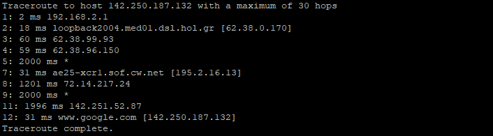
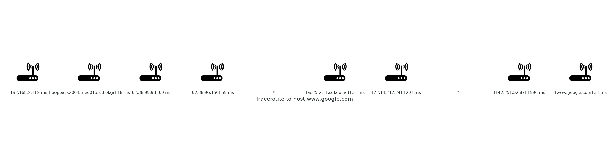

# Traceroute Graphs
## About
An implementation of the traceroute command in pure Python 3.8, using raw sockets and the ICMP protocol.  
A path diagram with the results of the command is rendered using the [Diagrams](https://diagrams.mingrammer.com/docs/getting-started/installation) module with [GraphViz](https://graphviz.org/gallery/).

### Requirement
The module runs only on Linux systems (I tested it in Ubuntu 20.04), due to raw socket incompatibility of other OS distributions. 
Also, root-level access is required when executing the script (use *sudo* 😃)

## Install Dependencies and Run 
```
sudo apt install graphviz
pip3 install diagrams
sudo python3 main.py
```

## Examples

